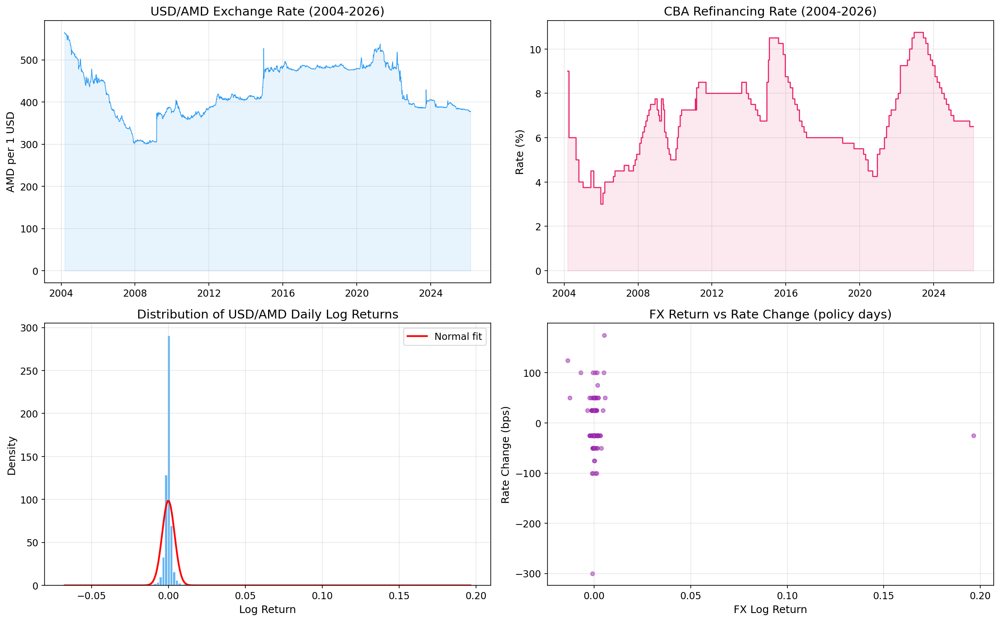
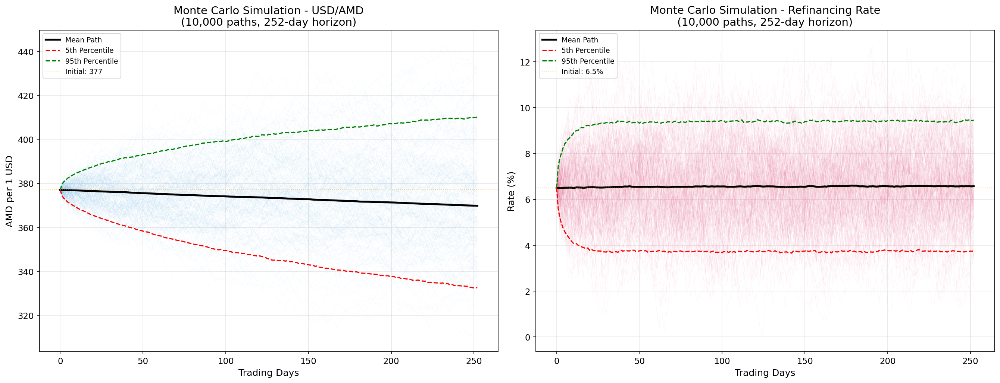
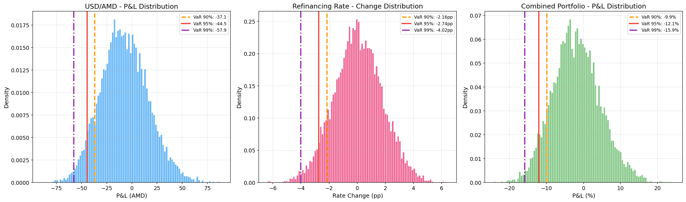
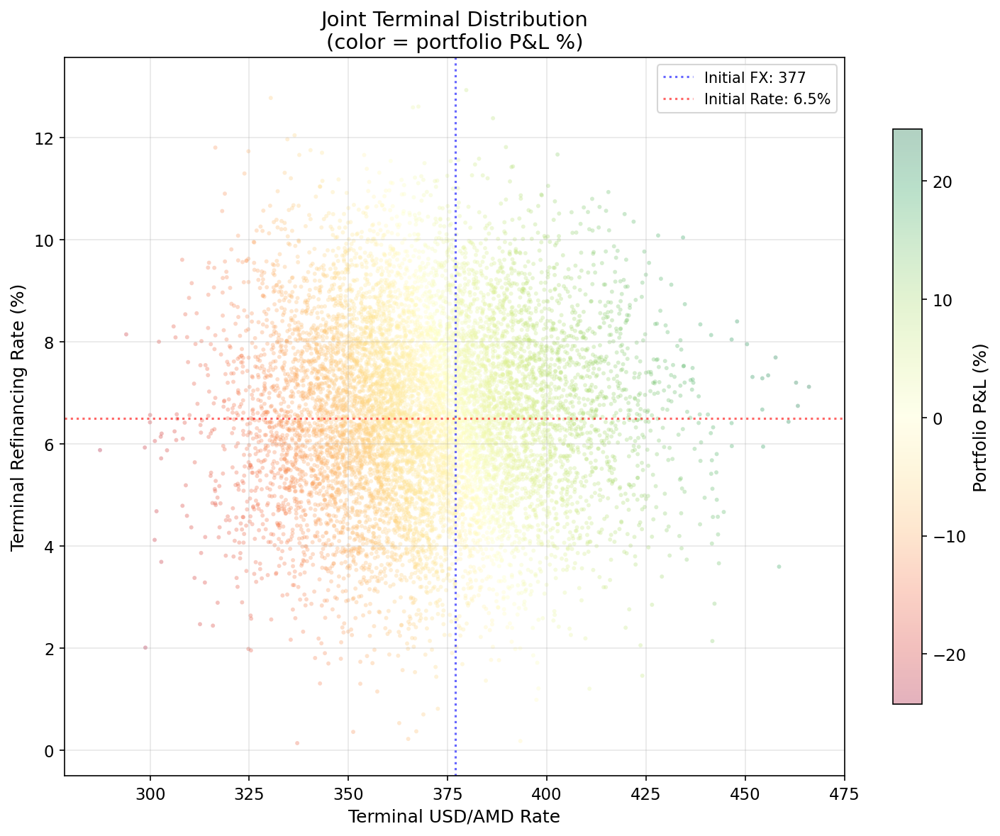
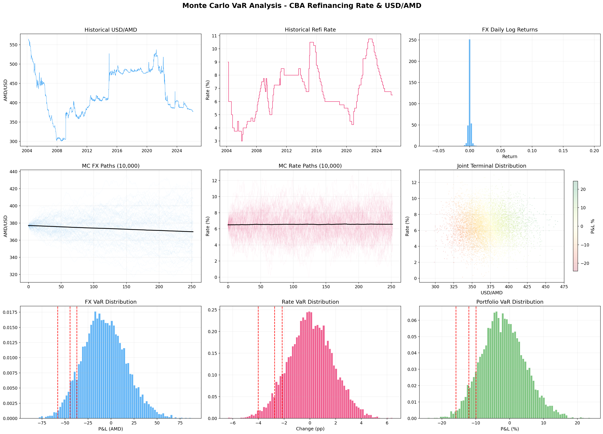

# Monte Carlo Simulation for Value at Risk (VaR) Estimation

## Assessing Foreign Exchange and Interest Rate Risk in Armenia

**Yerevan State University of Economics (YSUE)**
*February 2026*

---

## Table of Contents

1. [Problem Statement](#1-problem-statement)
2. [Background & Motivation](#2-background--motivation)
3. [Theoretical Framework](#3-theoretical-framework)
   - [Value at Risk (VaR)](#31-value-at-risk-var)
   - [Expected Shortfall (CVaR)](#32-expected-shortfall--conditional-var-cvar)
   - [Monte Carlo Simulation](#33-monte-carlo-simulation)
4. [Mathematical Models](#4-mathematical-models)
   - [Geometric Brownian Motion (GBM)](#41-geometric-brownian-motion-gbm--exchange-rate)
   - [Vasicek Model](#42-vasicek-model--refinancing-rate)
   - [Correlated Dynamics](#43-correlated-dynamics--cholesky-decomposition)
5. [Data](#5-data)
6. [Methodology](#6-methodology)
7. [Results](#7-results)
8. [Visualizations](#8-visualizations)
9. [Repository Structure](#9-repository-structure)
10. [Installation & Usage](#10-installation--usage)
11. [References](#11-references)

---

## 1. Problem Statement

Financial institutions, investors, and policymakers operating in the Armenian economy face two primary sources of macroeconomic risk:

1. **Exchange Rate Risk** - fluctuations in the USD/AMD exchange rate directly impact the cost of imports, foreign-denominated debt servicing, and the value of cross-border investments.
2. **Interest Rate Risk** - changes in the Central Bank of Armenia (CBA) refinancing rate ripple through the entire financial system, affecting lending rates, bond prices, government securities yields, and monetary policy transmission.

**The central question this study addresses:**

> *What is the maximum expected loss - at various confidence levels - that a portfolio exposed to both USD/AMD exchange rate movements and CBA refinancing rate changes could sustain over a one-year horizon?*

To answer this, we employ **Monte Carlo simulation** to estimate **Value at Risk (VaR)** and **Expected Shortfall (CVaR)** for individual risk factors and a combined portfolio.

---

## 2. Background & Motivation

### Why the CBA Refinancing Rate Matters

The **refinancing rate** is the key policy rate set by the Central Bank of Armenia. It serves as:

- **The benchmark for all monetary operations** - commercial banks borrow from the CBA at this rate, making it the floor for the entire interest rate structure in the economy.
- **An inflation-targeting tool** - the CBA adjusts the refinancing rate to steer inflation toward its target (currently ~4%).
- **A signal of monetary policy stance** - changes in the refinancing rate signal whether the CBA is tightening or easing, directly influencing business investment decisions and consumer credit.
- **A determinant of bond prices** - when the refinancing rate rises, the market value of existing fixed-income securities falls (and vice versa), creating interest rate risk for banks and institutional investors.

Since 2004, the CBA refinancing rate has ranged from **3.00%** (during periods of aggressive easing) to **10.75%** (during inflationary shocks). This wide band demonstrates the significant interest rate risk present in the Armenian financial system.

### Why the USD/AMD Exchange Rate Matters

Armenia is a small, open economy with significant dollarization. The USD/AMD rate is critical because:

- **Trade dependence** - Armenia imports a large share of goods priced in USD. A depreciating AMD increases import costs and domestic inflation.
- **Remittance flows** - a major source of foreign currency inflows. Exchange rate changes directly affect household income.
- **Foreign debt** - a substantial portion of public and private debt is denominated in USD. AMD depreciation increases the real burden of servicing this debt.
- **Financial stability** - rapid FX moves can trigger deposit flight, liquidity crises, and bank solvency concerns.

### Why Traditional Methods Fall Short

Classical parametric VaR assumes returns follow a **normal distribution**. However, financial return series typically exhibit:

- **Fat tails (leptokurtosis)** - extreme events occur far more frequently than a Gaussian model predicts
- **Skewness** - the distribution of returns is asymmetric
- **Volatility clustering** - periods of high volatility tend to persist
- **Regime changes** - structural breaks in policy or external shocks invalidate stationary assumptions

Our historical data confirms this: USD/AMD daily log returns exhibit a **kurtosis of ~1,055** (vs. 3 for a normal distribution), making parametric VaR dangerously unreliable. Monte Carlo simulation provides a distribution-free alternative that naturally captures these features.

---

## 3. Theoretical Framework

### 3.1 Value at Risk (VaR)

**Value at Risk** is a statistical measure that quantifies the maximum expected loss over a defined holding period at a given confidence level. Formally:

$$
\text{VaR}_\alpha = -\inf\{x \in \mathbb{R} : F_L(x) > \alpha\}
$$

where $F_L$ is the cumulative distribution function of portfolio losses $L$, and $\alpha$ is the significance level (e.g., 0.05 for 95% VaR).

In simpler terms:

$$
P(\Delta P \leq -\text{VaR}_\alpha) = 1 - \alpha
$$

where $\Delta P$ is the change in portfolio value over the holding period.

**Example:** A 95% VaR of -44.52 AMD means that there is only a **5% probability** that the USD/AMD rate will decline by more than 44.52 AMD over the next 252 trading days.

**Strengths of VaR:**
- Universally understood risk metric, adopted by Basel II/III regulatory framework
- Summarizes downside risk in a single number
- Enables comparison across asset classes

**Limitations of VaR:**
- Does not describe the magnitude of losses *beyond* the threshold
- Not subadditive in general (can violate diversification principles)
- Depends heavily on the method used for estimation

### 3.2 Expected Shortfall / Conditional VaR (CVaR)

**Expected Shortfall** (also called **Conditional VaR** or **CVaR**) addresses VaR's key limitation by measuring the *average* loss in the tail:

$$
\text{CVaR}_\alpha = -\frac{1}{1-\alpha} \int_0^{1-\alpha} \text{VaR}_u \, du = E\left[-\Delta P \mid \Delta P \leq -\text{VaR}_\alpha\right]
$$

CVaR answers: *"Given that we are in the worst $(1-\alpha)$% of scenarios, what is the expected loss?"*

**Properties:**
- CVaR is a **coherent risk measure** (subadditive, monotone, positive homogeneous, translation invariant)
- Always $\text{CVaR}_\alpha \geq \text{VaR}_\alpha$ - it provides a more conservative estimate
- Preferred by regulators under the Basel III Fundamental Review of the Trading Book (FRTB)

### 3.3 Monte Carlo Simulation

Monte Carlo simulation is a computational technique that uses repeated random sampling to model the probability distribution of uncertain outcomes. For financial risk:

1. **Specify stochastic models** for each risk factor (exchange rate, interest rate)
2. **Estimate model parameters** from historical data
3. **Generate $N$ random scenarios** (e.g., 10,000) by simulating forward paths
4. **Compute portfolio value** under each scenario
5. **Extract risk metrics** (VaR, CVaR) from the empirical distribution of P&L

**Advantages over parametric and historical simulation:**

| Method | Assumption | Tail Risk | Forward-Looking | Correlation |
|--------|-----------|-----------|----------------|-------------|
| Parametric VaR | Normal distribution | Underestimates | No | Linear only |
| Historical Simulation | Past = Future | Limited by sample | No | Implicit |
| **Monte Carlo** | **Model-driven** | **Flexible** | **Yes** | **Full structure** |

Monte Carlo is the most flexible approach because it can:
- Accommodate any distributional assumption
- Model nonlinear instruments (options, structured products)
- Capture complex dependency structures between risk factors
- Generate arbitrarily many scenarios for smooth tail estimation

---

## 4. Mathematical Models

### 4.1 Geometric Brownian Motion (GBM) - Exchange Rate

The USD/AMD exchange rate $S_t$ is modeled as a Geometric Brownian Motion:

$$
dS_t = \mu S_t \, dt + \sigma S_t \, dW_t^{(1)}
$$

where:
- $\mu$ is the drift (expected return per unit time)
- $\sigma$ is the volatility (standard deviation of returns per unit time)
- $W_t^{(1)}$ is a standard Wiener process (Brownian motion)

**Exact solution** (Itô's lemma):

$$
S_{t+\Delta t} = S_t \exp\left[\left(\mu - \frac{\sigma^2}{2}\right)\Delta t + \sigma \sqrt{\Delta t}\, Z_1\right]
$$

where $Z_1 \sim \mathcal{N}(0, 1)$.

The GBM model ensures:
- Prices remain **strictly positive** (log-normal distribution)
- Returns are **normally distributed** in log-space
- Volatility scales with the **square root of time**

**Estimated parameters from historical data (2004–2026):**

| Parameter | Symbol | Value | Unit |
|-----------|--------|-------|------|
| Daily drift | $\mu$ | −0.000073 | per day |
| Daily volatility | $\sigma$ | 0.004042 | per day |
| Annualized drift | $\mu_{ann}$ | −0.0184 | per year |
| Annualized volatility | $\sigma_{ann}$ | 6.42% | per year |

### 4.2 Vasicek Model - Refinancing Rate

The CBA refinancing rate $r_t$ is modeled using the **Vasicek (1977)** mean-reversion model:

$$
dr_t = \kappa(\theta - r_t)\, dt + \sigma_r \, dW_t^{(2)}
$$

where:
- $\kappa > 0$ is the **speed of mean reversion** - how quickly the rate reverts to its long-run level
- $\theta$ is the **long-run equilibrium rate** - the level to which the rate tends over time
- $\sigma_r$ is the **volatility** of rate innovations
- $W_t^{(2)}$ is a standard Wiener process

**Discretized form (Euler-Maruyama scheme):**

$$
r_{t+\Delta t} = r_t + \kappa(\theta - r_t)\Delta t + \sigma_r \sqrt{\Delta t}\, Z_2
$$

where $Z_2 \sim \mathcal{N}(0, 1)$.

**Key properties of the Vasicek model:**
- **Mean-reversion:** When $r_t > \theta$, the drift is negative (rate decreases); when $r_t < \theta$, the drift is positive (rate increases). This captures the stylized fact that central banks adjust rates back toward equilibrium.
- **Stationary distribution:** As $t \to \infty$, $r_t \sim \mathcal{N}\left(\theta, \frac{\sigma_r^2}{2\kappa}\right)$
- **Half-life of reversion:** $t_{1/2} = \frac{\ln 2}{\kappa}$ - the time for a deviation from $\theta$ to halve.
- **Known limitation:** Rates can become negative. We impose a floor at 0%.

**Parameter estimation** via OLS regression on $\Delta r_t = a + b \cdot r_{t-1} + \varepsilon_t$:

$$
\kappa = -b, \qquad \theta = -\frac{a}{b}
$$

**Estimated parameters:**

| Parameter | Symbol | Value | Interpretation |
|-----------|--------|-------|----------------|
| Mean-reversion speed | $\kappa$ | 0.0588 | Half-life ≈ 11.8 years |
| Long-run equilibrium | $\theta$ | 6.55% | Long-run policy rate |
| Rate volatility | $\sigma_r$ | 0.5821 | Per-step volatility |

### 4.3 Correlated Dynamics - Cholesky Decomposition

The exchange rate and refinancing rate are not independent - monetary tightening (higher refinancing rate) can strengthen the AMD (lower USD/AMD), implying a negative correlation. To capture this **joint behavior**, we generate correlated random shocks using **Cholesky decomposition**.

Given the correlation matrix:

$$
\Sigma = \begin{pmatrix} 1 & \rho \\ \rho & 1 \end{pmatrix}
$$

The **Cholesky factor** $L$ satisfies $\Sigma = L L^T$:

$$
L = \begin{pmatrix} 1 & 0 \\ \rho & \sqrt{1 - \rho^2} \end{pmatrix}
$$

For independent standard normals $\mathbf{Z} = (Z_1, Z_2)^T$, the correlated shocks are:

$$
\mathbf{Z}_{\text{corr}} = L \cdot \mathbf{Z} = \begin{pmatrix} Z_1 \\ \rho Z_1 + \sqrt{1 - \rho^2}\, Z_2 \end{pmatrix}
$$

**Estimated correlation:** $\rho = -0.0509$

The negative sign confirms the expected economic relationship: when FX rates move in one direction, the interest rate tends to adjust in the opposite direction (though the correlation is weak, suggesting other factors dominate).

---

## 5. Data

### Data Sources

| Dataset | Source | Period | Frequency | Observations |
|---------|--------|--------|-----------|-------------|
| CBA Refinancing Rate | [Central Bank of Armenia](https://www.cba.am) | Jan 2004 – Feb 2026 | Per policy meeting (~140 decisions) | Forward-filled to daily |
| USD/AMD Exchange Rate | [Central Bank of Armenia](https://www.cba.am) | Jan 2000 – Feb 2026 | Daily | ~6,639 trading days |

### Data Preprocessing

1. **Refinancing Rate:** Published at each policy meeting (irregular frequency). Forward-filled to create a daily series assuming the rate remains effective until the next decision date.
2. **Exchange Rate:** Daily official rate published by CBA. Missing values removed. Log returns computed as $r_t = \ln(S_t / S_{t-1})$.
3. **Merged Dataset:** Inner join on date, yielding **~5,600** overlapping daily observations (2004–2026).

### Descriptive Statistics

| Statistic | USD/AMD Daily Log Return | Refi Rate Change (bps) |
|-----------|:------------------------:|:----------------------:|
| Mean | −0.0001 | −0.0451 |
| Std Dev | 0.0040 | 7.9070 |
| Skewness | 20.92 | −6.89 |
| Kurtosis | 1,055.27 | 480.20 |
| 1st Percentile | −0.0075 | −25.00 |
| 5th Percentile | −0.0034 | 0.00 |
| 95th Percentile | 0.0029 | 0.00 |
| 99th Percentile | 0.0072 | 0.00 |

> **Observation:** Both series exhibit **extreme leptokurtosis** (excess kurtosis >> 0) and **significant skewness**. This confirms that a Gaussian assumption would severely underestimate tail risk. The refinancing rate change distribution is heavily concentrated at zero (rate unchanged on most days) with occasional large discrete jumps - a typical feature of policy rates.

---

## 6. Methodology

### Simulation Design

| Parameter | Value |
|-----------|-------|
| Number of simulations ($N$) | 10,000 |
| Horizon ($T$) | 252 trading days (~1 year) |
| Time step ($\Delta t$) | 1 day |
| Initial USD/AMD rate ($S_0$) | 377.00 AMD/USD |
| Initial refinancing rate ($r_0$) | 6.50% |
| Random seed | 42 (for reproducibility) |
| Confidence levels | 90%, 95%, 99% |

### Algorithm

```
1. ESTIMATE model parameters (μ, σ, κ, θ, σ_r, ρ) from historical data
2. COMPUTE Cholesky factor L from correlation matrix
3. FOR each simulation i = 1, ..., N:
    a. SET S₀ = 377.00, r₀ = 6.50%
    b. FOR each day t = 1, ..., 252:
        i.   DRAW Z = (Z₁, Z₂) ~ N(0, I₂)
        ii.  COMPUTE Z_corr = L · Z
        iii. UPDATE S_t using GBM equation
        iv.  UPDATE r_t using Vasicek equation (floor at 0%)
    c. RECORD terminal values S_T, r_T
4. COMPUTE P&L for each simulation:
    - FX P&L:  ΔS = S_T - S₀
    - Rate P&L: Δr = r_T - r₀
    - Portfolio: V_T = S_T × (1 + r_T/100), ΔV = V_T - V₀
5. EXTRACT VaR and CVaR from empirical P&L distribution
```

### Combined Portfolio Definition

The combined portfolio value is defined as:

$$
V_t = S_t \times \left(1 + \frac{r_t}{100}\right)
$$

This represents the value of a **1 USD position converted to AMD**, earning the prevailing refinancing rate. The portfolio P&L captures both FX depreciation/appreciation and interest rate changes simultaneously.

---

## 7. Results

### 7.1 Initial Conditions (as of 2026-02-27)

| Metric | Value |
|--------|-------|
| USD/AMD Rate | **377.00** AMD per 1 USD |
| Refinancing Rate | **6.50%** |
| Simulation Horizon | **252 trading days** (~1 year) |
| Number of Simulations | **10,000** |
| Random Seed | 42 |

### 7.2 VaR & CVaR - USD/AMD Exchange Rate

| Confidence | VaR (AMD) | VaR (%) | CVaR (AMD) | CVaR (%) |
|:----------:|:---------:|:-------:|:----------:|:--------:|
| **90%** | −37.14 | −9.85% | −46.82 | −12.42% |
| **95%** | −44.52 | −11.81% | −52.90 | −14.03% |
| **99%** | −57.91 | −15.36% | −65.05 | −17.26% |

**Interpretation:** At the 95% confidence level, the USD/AMD rate is not expected to depreciate by more than **44.52 AMD** (from 377 → ~332 AMD/USD) over the next year. If the VaR threshold is breached (5% worst cases), the average loss is **52.90 AMD** (CVaR).

### 7.3 VaR & CVaR - CBA Refinancing Rate

| Confidence | VaR (pp) | VaR (bps) | CVaR (pp) |
|:----------:|:--------:|:---------:|:---------:|
| **90%** | −2.1556 | −215.56 | −2.9636 |
| **95%** | −2.7416 | −274.16 | −3.4992 |
| **99%** | −4.0174 | −401.74 | −4.5713 |

**Interpretation:** At 95% confidence, the refinancing rate will not drop by more than **2.74 percentage points** (from 6.50% → ~3.76%). At 99%, the worst-case decline is **4.02 pp** (rate could fall to ~2.48%).

### 7.4 VaR & CVaR - Combined Portfolio (FX + Rate Risk)

| Confidence | VaR (AMD) | VaR (%) | CVaR (AMD) | CVaR (%) |
|:----------:|:---------:|:-------:|:----------:|:--------:|
| **90%** | −39.86 | −9.93% | −50.80 | −12.65% |
| **95%** | −48.51 | −12.08% | −57.64 | −14.35% |
| **99%** | −63.80 | −15.89% | −71.43 | −17.79% |

**Interpretation:** The combined portfolio VaR at 95% is **−48.51 AMD (−12.08%)**, meaning there is a 5% probability of losing more than 12% of portfolio value over one year when accounting for both FX and interest rate risks simultaneously.

### 7.5 Summary Comparison

| Risk Metric | 90% CL | 95% CL | 99% CL |
|-------------|:------:|:------:|:------:|
| FX VaR | −9.85% | **−11.81%** | −15.36% |
| Rate VaR | −216 bps | **−274 bps** | −402 bps |
| Portfolio VaR | −9.93% | **−12.08%** | −15.89% |
| Portfolio CVaR | −12.65% | **−14.35%** | −17.79% |

### 7.6 Key Findings

1. **At 95% confidence over a 1-year horizon:**
   - The USD/AMD rate will not fall below **~332 AMD/USD** (from 377)
   - The refinancing rate will not drop below **~3.76%** (from 6.5%)
   - Combined portfolio loss will not exceed **12.08%**
   - If VaR is breached, the expected tail loss (CVaR) is **14.35%**

2. **At 99% confidence**, the worst-case portfolio loss is **15.89%** (~63.80 AMD)

3. **Diversification benefit:** The **negative correlation** ($\rho = -0.051$) between FX and refinancing rate provides a small natural hedge - the combined portfolio VaR is slightly less than the sum of individual VaRs. Economically, this makes sense: when the CBA raises rates (positive for rate risk), it tends to strengthen the AMD (positive for FX risk), partially offsetting losses.

4. **Fat tails matter:** Historical kurtosis exceeding 1,000 for FX returns validates the Monte Carlo approach. A parametric Normal VaR would estimate the 99% FX loss at only ~$3.1\sigma \approx 28$ AMD - roughly **half** of our Monte Carlo estimate of 57.91 AMD. Relying on parametric assumptions would dangerously underestimate tail risk.

5. **Mean reversion in interest rates:** The Vasicek model's estimated half-life of ~11.8 years implies that the refinancing rate reverts slowly to its 6.55% equilibrium, allowing significant deviations within the 1-year horizon.

---

## 8. Visualizations

### Historical Data & Exploratory Analysis

*Figure 1: Historical time series of USD/AMD exchange rate and CBA refinancing rate (2004–2026), with daily log-return distribution.*

### Monte Carlo Simulated Paths

*Figure 2: 10,000 simulated paths for USD/AMD (GBM) and Refinancing Rate (Vasicek) over 252-day horizon. Black line = mean path; dashed lines = 5th/95th percentile bands.*

### VaR Distributions

*Figure 3: Empirical P&L distributions with VaR thresholds at 90%, 95%, and 99% confidence levels for FX, interest rate, and combined portfolio.*

### Joint Terminal Distribution

*Figure 4: Scatter plot of 10,000 terminal (USD/AMD, Refinancing Rate) pairs. Color encodes portfolio P&L (%). Crosshairs mark initial conditions.*

### Full Dashboard

*Figure 5: Complete 3x3 analysis dashboard combining historical data, simulated paths, and risk distributions.*

---

## 9. Repository Structure

```
Monte Carlo Simulation/
├── Monte_Carlo_VaR.ipynb          # Main Jupyter notebook (full analysis)
├── monte_carlo_var.py             # Standalone Python script
├── data/
│   ├── refinance rate.xlsx        # CBA refinancing rate data (2004–2026)
│   └── exchange rate.csv          # USD/AMD daily exchange rates (2000–2026)
├── results/
│   ├── metrics.json               # All numerical results in JSON format
│   ├── figures/
│   │   ├── historical_analysis.png
│   │   ├── simulated_paths.png
│   │   ├── var_distributions.png
│   │   ├── joint_terminal_distribution.png
│   │   └── full_dashboard.png
│   └── tables/
│       ├── descriptive_statistics.csv
│       └── var_results.csv
├── requirements.txt
├── .gitignore
└── README.md
```

---

## 10. Installation & Usage

### Prerequisites

```bash
pip install -r requirements.txt
```

**Required packages:** numpy, pandas, matplotlib, scipy, openpyxl

### Run the Jupyter Notebook

```bash
jupyter notebook Monte_Carlo_VaR.ipynb
```

### Run the Standalone Script

```bash
python monte_carlo_var.py
```

---

## 11. References

1. **Vasicek, O.** (1977). "An equilibrium characterization of the term structure." *Journal of Financial Economics*, 5(2), 177–188.
2. **Jorion, P.** (2006). *Value at Risk: The New Benchmark for Managing Financial Risk*. 3rd ed., McGraw-Hill.
3. **Glasserman, P.** (2003). *Monte Carlo Methods in Financial Engineering*. Springer.
4. **Artzner, P., Delbaen, F., Eber, J.-M., & Heath, D.** (1999). "Coherent Measures of Risk." *Mathematical Finance*, 9(3), 203–228.
5. **Hull, J. C.** (2018). *Options, Futures, and Other Derivatives*. 10th ed., Pearson.
6. **Basel Committee on Banking Supervision** (2019). "Minimum capital requirements for market risk." Bank for International Settlements.
7. **Central Bank of Armenia** - [https://www.cba.am](https://www.cba.am) - Data source for refinancing rate and official exchange rates.

---

## License

This project is for educational and research purposes at **Yerevan State University of Economics (YSUE)**.

---
